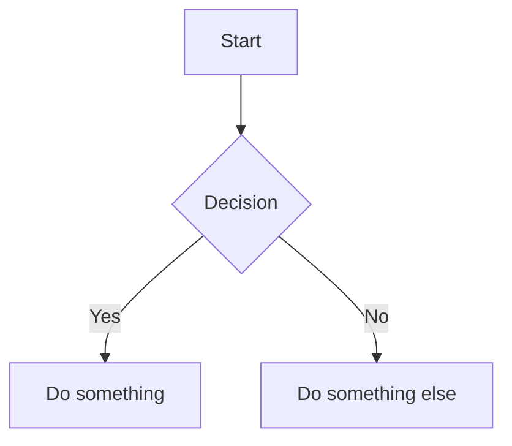

# Understanding Archive and File Signing and Integrity in Kinnoo

This file contains a verbatim transcript of a technical conversation about archive signing, integrity verification, and the role of `--strict` and `--sign` flags in the kinnoo CLI. The conversation begins with the user's question:

---

**User:**
What exactly does --strict do for kinnoo publish ? Is it similar to --sign for kinnoo pack ?

**Copilot:**
The `--strict` flag for `kinnoo publish` enforces strict signature and trust verification gates before allowing a publish/upload operation. Here’s what it does, and how it compares to `--sign` for `kinnoo pack`:

### What `--strict` does for `kinnoo publish`
- **Requires valid signature artifacts:** The archive must have both a detached signature file (`.sig`) and signature metadata (`.sig.json`).
- **Verifies the signature:** It runs `verify_detached_signature_artifacts()` to ensure the archive is properly signed with a valid Ed25519 key.
- **Blocks unsigned or invalid artifacts:** If the signature files are missing or invalid, publish fails with an error, instructing you to re-pack with `--sign`.
- **Prevents accidental/unauthorized publishing:** Only archives that pass signature verification can be published with `--strict`.

### How it compares to `--sign` for `kinnoo pack`
- `--sign` (on `kinnoo pack`) **creates** the signature and signature metadata files for the archive, using the provided Ed25519 private key.
- `--strict` (on `kinnoo publish`) **requires and verifies** those signature files before allowing the publish.

**Summary:**  
- `--sign` is for signing at pack time (producing the signature).
- `--strict` is for enforcing that only properly signed archives can be published (consuming and verifying the signature).

This is a security gate to ensure only authenticated, non-tampered agents are published when strict mode is enabled.

---

**User:**
What happens if a developer uses kinnoo pack --sign to sign an archive, but does not use --strict when publishing?

**Copilot:**
If a developer uses `kinnoo pack --sign` to sign an archive, but does **not** use `--strict` when publishing with `kinnoo publish`, here’s what happens:

- The archive will be published **regardless of whether it is signed or not**. The presence of signature files (`.sig`, `.sig.json`) is not required or checked.
- The publish command will **not verify** the signature or enforce any trust/supply chain checks. It simply uploads the archive (and, if present, the checksum sidecar).
- If the signature files exist, they are published alongside the archive, but their validity is not checked.
- If the archive is unsigned, it will still be published without error.

**Summary:**  
- Signing with `--sign` at pack time creates signature files, but unless you use `--strict` at publish time, those signatures are not enforced or verified.
- `kinnoo publish` without `--strict` is permissive: it allows both signed and unsigned archives to be published.

This means that `--sign` and `--strict` are independent: signing prepares the archive for strict verification, but only `--strict` enforces that verification at publish time.

---

**User:**
And then kinnoo install --strict is used to install an archive that has been signed, correct? What if --strict flag is not used during kinnoo install, on an archive that has been signed?

**Copilot:**
Yes, `kinnoo install --strict` is used to install an archive that has been signed, and it enforces strict verification of both the embedded integrity manifest and the signature.

Here’s what happens in both cases:

---

### If you use `kinnoo install --strict`:
- **Requires**: `META-INF/integrity.json` (per-file hashes) and `META-INF/signature.json` (Ed25519 signature) must exist in the archive.
- **Verifies**: 
  - All files match the hashes in `integrity.json`.
  - The signature in `signature.json` is valid for the integrity manifest and matches the expected public key.
- **Fails**: If any of these checks are missing or invalid, install aborts with an error.
- **Guarantee**: Only a properly signed and untampered archive can be installed.

---

### If you do **not** use `--strict` during `kinnoo install` (even on a signed archive):
- **Behavior**: 
  - The installer will still check for `META-INF/integrity.json` and verify file hashes if present, but will **not require** it.
  - If the integrity manifest is missing, it prints a warning but continues (for backward compatibility).
  - It does **not require or verify** the embedded signature (`signature.json`).
- **Result**: The archive will be installed even if unsigned, or if the signature is missing/invalid, as long as basic integrity checks pass or are skipped.

---

**Summary:**  
- `--strict` enforces full signature and integrity verification and is required for maximum supply chain security.
- Without `--strict`, install is permissive: it allows unsigned or legacy archives and does not enforce signature checks, even if the archive is signed.

This allows for backward compatibility and flexibility, but only `--strict` guarantees cryptographic verification.

---

**User:**
1. what does "as long as basic integrity checks pass" mean? What basic integrity checks are run, even without strict mode?
2. Earlier you said "The archive must have both a detached signature file (.sig) and signature metadata (.sig.json)." but now you are saying the signatures are in META-INF/signature.json. I'm confused

**Copilot:**
Great questions—let’s clarify both points:

---

### 1. What does "as long as basic integrity checks pass" mean? What basic integrity checks are run, even without strict mode?

**Without `--strict`, kinnoo install does:**
- Looks for `META-INF/integrity.json` inside the archive.
  - If present: It loads the manifest and verifies that each file in the archive matches its recorded SHA-256 hash.
  - If missing: It prints a warning but continues (for backward compatibility).
- **No signature verification is performed** (neither embedded nor sidecar).
- If any file fails the hash check (i.e., the file’s contents don’t match the hash in `integrity.json`), install fails with an integrity mismatch error.

**So, “basic integrity checks” means:**  
- If `META-INF/integrity.json` exists, all files are hashed and compared to the manifest.
- If it doesn’t exist, install continues with a warning (no hash checks).

---

### 2. Detached signature files vs. embedded signature (where are signatures checked?)

**There are two signature mechanisms in kinnoo:**

#### a) **Detached signature files (sidecars):**
- These are `.sig` and `.sig.json` files that live *outside* the archive, next to the `.kno` file.
- Used by: `kinnoo pack --sign` (creates them), and `kinnoo publish --strict` (requires and verifies them).

#### b) **Embedded signature (inside the archive):**
- This is `META-INF/signature.json` *inside* the archive.
- Used by: `kinnoo install --strict` (requires and verifies it, along with `META-INF/integrity.json`).

**Summary Table:**

| Operation                | Signature Required | Where?                       |
|--------------------------|-------------------|------------------------------|
| kinnoo pack --sign       | Yes (produces)    | Sidecar: `.sig`, `.sig.json` |
| kinnoo publish --strict  | Yes (verifies)    | Sidecar: `.sig`, `.sig.json` |
| kinnoo install --strict  | Yes (verifies)    | Embedded: `META-INF/signature.json` |

- **Sidecar signatures** are for publishing and registry workflows.
- **Embedded signatures** are for install-time verification.

**Why both?**  
- Sidecars are easier for registries and backward compatibility.
- Embedded signatures make the archive self-verifying, especially when shared outside the registry.

---

**In summary:**
- “Basic integrity checks” = file hash verification via `META-INF/integrity.json` (if present).
- Sidecar signatures are used for publish strictness; embedded signatures are used for install strictness.

Let me know if you want a diagram or code references for either!

---

**User:**
A diagram would be great

**Copilot:**
Here’s a diagram showing how kinnoo handles sidecar and embedded signatures during pack, publish, and install:

```mermaid
flowchart TD
    subgraph Packing
        A1[kinnoo pack]
        A2[--sign (optional)]
        A3[Produces .sig & .sig.json sidecars]
        A4[Produces META-INF/integrity.json]
        A5[Produces META-INF/signature.json]
        A1 -->|always| A4
        A1 -->|if --sign| A2 --> A3
        A1 -->|if --sign| A5
    end

    subgraph Publishing
        B1[kinnoo publish]
        B2[--strict (optional)]
        B3[Requires .sig & .sig.json sidecars]
        B4[Verifies sidecar signature]
        B1 -->|if --strict| B2 --> B3 --> B4
        B1 -->|no --strict| B5[No signature required]
    end

    subgraph Installing
        C1[kinnoo install]
        C2[--strict (optional)]
        C3[Requires META-INF/integrity.json & signature.json]
        C4[Verifies embedded signature]
        C5[Verifies file hashes]
        C1 -->|if --strict| C2 --> C3 --> C4
        C3 --> C5
        C1 -->|no --strict| C6[If integrity.json exists, verify hashes; else warn]
    end

    %% Legend
    classDef sidecar fill:#ffe0b2,stroke:#e65100
    classDef embedded fill:#c8e6c9,stroke:#1b5e20
    A3,B3,B4 sidecar
    A4,A5,C3,C4 embedded
```

- **Orange** = sidecar signature files (external to archive, used for publish strictness)
- **Green** = embedded integrity/signature (inside archive, used for install strictness)

This shows exactly when and where each type of signature is produced, required, and verified. Let me know if you want a PNG or further breakdown!

---

**User:**
What language did you use for the above flowchart - and how can I create a visual flowchart diagram from that code above

**Copilot:**
The flowchart above is written in **Mermaid** language—a simple, text-based diagramming syntax. Mermaid is widely supported in modern Markdown editors (like VS Code, Obsidian, GitHub, Notion, and more) and can be rendered directly in many documentation tools.

---

### How to create a visual flowchart from Mermaid code

1. **Copy the Mermaid code block** (from above, everything between ```mermaid and ```).
2. **Paste it into a tool that supports Mermaid rendering:**
   - **VS Code:** Install the "Markdown Preview Mermaid Support" extension, then open a Markdown file and preview it.
   - **Obsidian:** Paste into a note and it will render automatically.
   - **GitHub:** Paste into a Markdown file and view it on GitHub (Mermaid is supported in .md files).
   - **Online editors:** Use [Mermaid Live Editor](https://mermaid.live/)—just paste the code and see the diagram instantly.
   - **Notion:** Paste the code into a Mermaid block.

3. **Export as PNG/SVG:** Most editors (including Mermaid Live Editor) let you export the rendered diagram as an image.

---

**Example:**


Paste this into Mermaid Live Editor or a supported Markdown file to see the visual flowchart.

---

**Summary:**  
- The language is **Mermaid**.
- Use any Mermaid-compatible tool or editor to render and export the diagram visually.

Let me know if you want a rendered PNG/SVG or have a specific tool in mind!

---

**User:**
Still confused. How and when are META-INF/integrity.json and META-INF/signature.json created? And what's the difference between .sig and .sig.json? And if .sig and .sig.json are the signatures for the archive itself, then what is META-INF/signature.json ?

**Copilot:**
Let’s clarify each part step by step:

---

### 1. How and when are `META-INF/integrity.json` and `META-INF/signature.json` created?

- **`META-INF/integrity.json`**  
  - **Created by:** `kinnoo pack` (always, for every archive)
  - **How:**  
    - When you run `kinnoo pack`, it computes the SHA-256 hash of every file in the agent directory (except files in `META-INF/`).
    - It writes a manifest (`integrity.json`) listing each file and its hash into the `META-INF/` directory inside the `.kno` archive.
  - **Purpose:**  
    - Allows anyone to verify that the files inside the archive haven’t been tampered with.

- **`META-INF/signature.json`**  
  - **Created by:** `kinnoo pack --sign` (only if you use `--sign`)
  - **How:**  
    - After creating `integrity.json`, `kinnoo pack --sign` signs the contents of `integrity.json` using your Ed25519 private key.
    - It writes the resulting signature (and the public key/fingerprint) into `META-INF/signature.json` inside the archive.
  - **Purpose:**  
    - Allows anyone to verify that the integrity manifest itself was signed by a trusted publisher.

---

### 2. What’s the difference between `.sig` and `.sig.json`?

- **`.sig`**  
  - This is a detached signature file for the entire `.kno` archive (the ZIP file itself).
  - It contains the raw Ed25519 signature bytes (often base64-encoded).

- **`.sig.json`**  
  - This is a metadata file that accompanies `.sig`.
  - It contains information about the signature: the public key, fingerprint, algorithm, and possibly other metadata (like timestamp or signer identity).

- **How are they created?**  
  - Both are created by `kinnoo pack --sign` as *sidecar* files, written next to the `.kno` archive (not inside it).

---

### 3. If `.sig` and `.sig.json` are signatures for the archive itself, then what is `META-INF/signature.json`?

- **`.sig` and `.sig.json`**  
  - **What they sign:** The entire `.kno` archive (ZIP file) as a single binary blob.
  - **Purpose:** Used by registries and by `kinnoo publish --strict` to verify the archive hasn’t been tampered with after packing.

- **`META-INF/signature.json`**  
  - **What it signs:** The contents of `META-INF/integrity.json` (the per-file hash manifest inside the archive).
  - **Purpose:** Used by `kinnoo install --strict` to verify that the integrity manifest (and thus all files) were signed by a trusted publisher, making the archive self-verifying even if sidecar files are lost.

---

### **Summary Table**

| File                       | Created by           | Signs/Verifies           | Used by (strict mode)         | Location         |
|----------------------------|----------------------|--------------------------|-------------------------------|------------------|
| `.sig`                     | pack --sign          | Whole archive (ZIP)      | publish, registry verification| Sidecar (external)|
| `.sig.json`                | pack --sign          | Metadata for `.sig`      | publish, registry verification| Sidecar (external)|
| `META-INF/integrity.json`  | pack (always)        | Per-file hashes          | install (all modes)           | Inside archive   |
| `META-INF/signature.json`  | pack --sign          | Signs integrity manifest | install --strict              | Inside archive   |

---

**In short:**
- `.sig`/`.sig.json` = signature and metadata for the whole archive (external, for publishing/registry).
- `META-INF/integrity.json` = per-file hashes (internal, always).
- `META-INF/signature.json` = signature for the integrity manifest (internal, for install-time verification).

Let me know if you want code references or a visual for this!

**user**
For kinnoo install, explain in a bit more detail what these options do:

--accept-permissions Acknowledge and accept declared manifest permissions during non-interactive install (IS THIS USED IN CONJUNCTION WITH --yes option?)
--allow-unverified-publisher
Allow non-interactive install when archive has no publisher signature metadata (IS THIS USED IN CONJUNCTION WITH --yes option?)
--frozen Require lockfile-only reproducible install; fail on lock drift or missing entries

**copilot**
--accept-permissions
Purpose: Automatically acknowledges and accepts all permissions declared in the agent’s kinnoo.yaml manifest (e.g., network, file access) during install.
Typical Use: For non-interactive or scripted installs (CI/CD, automation) where you can’t manually approve permissions.
Relation to --yes:
--yes skips all interactive prompts (like “Proceed with install?”).
--accept-permissions specifically skips the permission consent prompt.
Best practice: Use both together for fully non-interactive installs:
kinnoo install --yes --accept-permissions ...
--allow-unverified-publisher
Purpose: Allows installation of an archive that does not have a verified publisher signature (i.e., unsigned or self-signed).
Typical Use: For testing, local development, or when you trust the source but it’s not signed.
Relation to --yes:
--yes skips general prompts.
--allow-unverified-publisher specifically skips the publisher verification prompt.
Best practice: Use both together for non-interactive installs of unsigned agents:
kinnoo install --yes --allow-unverified-publisher ...
--frozen
Purpose: Enforces strict lockfile-based reproducibility.
Behavior:
Only installs agents/versions/hashes exactly as specified in kinnoo-lock.yaml.
Fails if the lockfile is missing, out of date, or if the install would cause “lock drift” (i.e., the installed agent would differ from the lockfile).
Use case: For production, CI, or any environment where you want guaranteed reproducibility and no surprises.
Summary:

--accept-permissions and --allow-unverified-publisher are often used with --yes for fully automated installs.
--frozen is for strict, lockfile-driven reproducibility—install fails if anything would change.